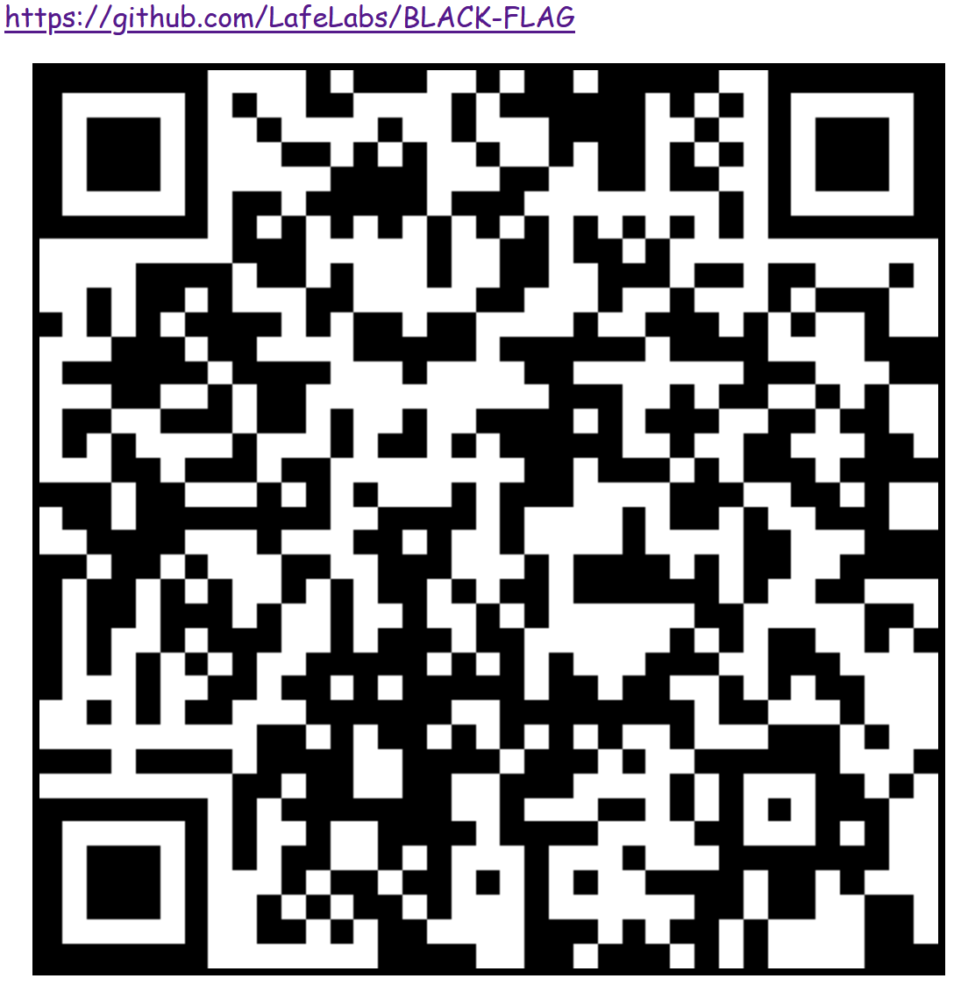
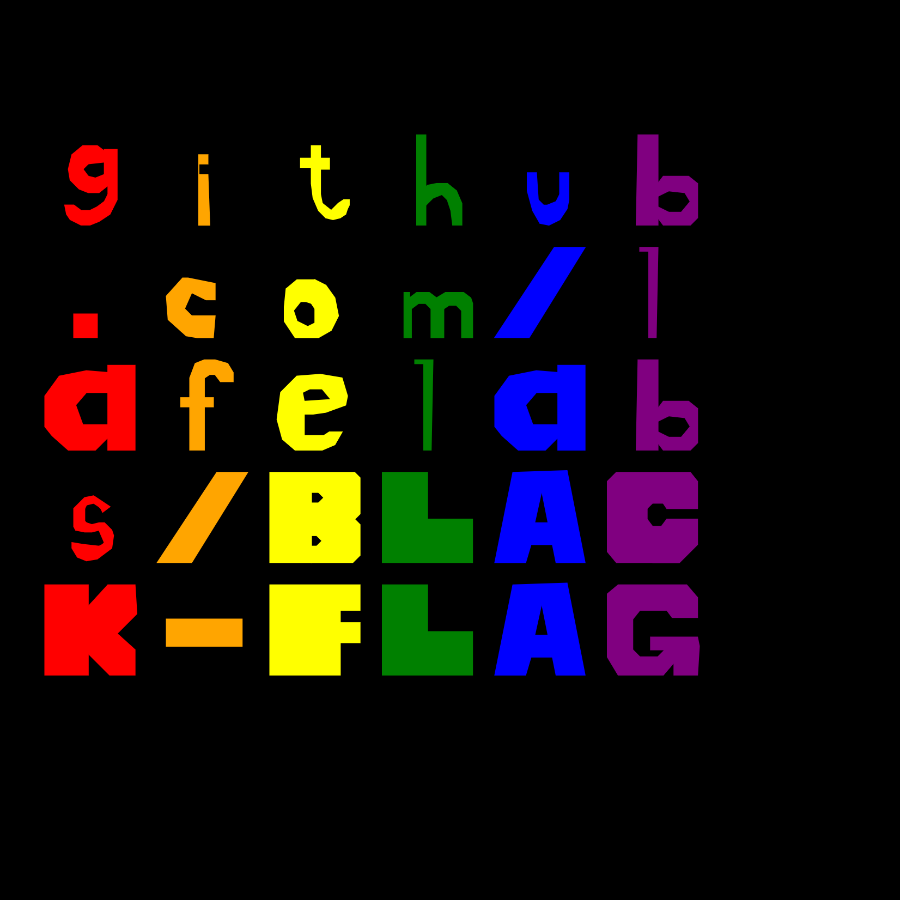
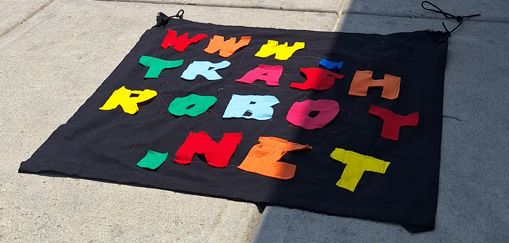

# [BLACK-FLAG](https://www.github.com/LafeLabs/BLACK-FLAG)

THE BLACK FLAG IS BOTH HTML AND TEXTILE, BOTH ON THE WEB AND BY THE HIGHWAY!

A BLACK FLAG IS A BLACK SQUARE OF SIDE "UNIT", WHERE UNIT IS A METER FOR TEXTILE FLAGS AND JUST UNDER THE SMALLER OF SCREEN WIDTH AND HEIGHT IN HTML!

A BLACK FLAG IS A HYPERLINK!
A BLACK FLAG IS A MESSAGE!

ON THE BLACK FLAG ARE A SET OF LETTERS! 

EACH LETTER IS CUT OUT OF A SQUARE OF COLOR OTHER THAN BLACK(SO THAT IT IS VISIBLE ON THE BLACK FLAG)!  

LETTER SQUARES ARE TYPICALLY 0.1 UNITS IN WIDTH!

ALL THE ASCII CHARACTERS HAVE A SEQUENCE OF VERTICES THAT MAKE UP THE CUT OUT PATTERN TO GO FROM BLOCK TO LETTER!

IN HTML THESE ARE STORED IN A JSON OBJECT WHICH IS SAVED IN A .TXT FILE!

WE CUT AND STITCH LETTERS ON THE FLAGS!

WE MAKE .PNG FILES TO POST ONLINE!

WE CAN SHARE FONTS AND FLAGS USING RAW JSON!

JUST COPY AND PASTE USING THE HTML EDITOR!

USE THE XAMPP SERVER TO RUN WEB SERVER LOCALLY!

OR FORK ON ANOTHER TRASH MAGIC SERVER!

HEM EDGES OF TEXTILE FLAGS!

COLLECT TEXTILE WASTE IN SHOPPING CARTS ALONG HIGHWAY!

CUT, AND STITCH INTO MORE BLACK FLAGS ALONG HIGHWAY!

SELF-REPLIATING MEDIA MADE OF TRASH ALONG SIDE OF HIGHWAY!

 - [index.html](index.html)
 - [edit-php.html](edit-php.html)
 - [http://localhost/BLACK-FLAG/](http://localhost/BLACK-FLAG/)
 - [edit-flag.html](edit-flag.html)
 - [flag.txt](flag.txt)
 - [ascii.txt](ascii.txt)
 - [qrcode.html](qrcode.html)
 - [php/replicator.txt](php/replicator.txt)
 - [global replicator](https://raw.githubusercontent.com/lafelabs/BLACK-FLAG/refs/heads/main/php/replicator.txt)